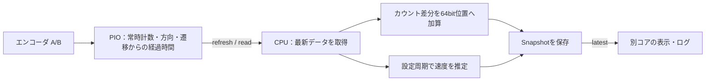

[English](./README.md) | 日本語

[](https://github.com/Suzu-Gears/Pico_PIO_Encoder/actions/workflows/ci.yml)

# Pico_PIO_Encoder

## 概要

**Arduino（arduino-pico）とPico SDKに対応する、RP2040 / RP235X用PIOエンコーダライブラリ**です。
位置と速度の更新周期を独立に設定でき、連続・非連続のA/B配線を用途に合わせて選べます。

**0.4.0** · [English / API一覧](README.md) · [変更履歴](CHANGELOG.md) · [検証結果](docs/VALIDATION_RESULTS.md)

PIOがA/Bの4逓倍カウントと遷移からの経過時間を取得し、CPU側で64bitの実測位置、補間位置、速度を計算します。

初めて使う場合は、[配線方式](#配線に合わせて初期化方法を選ぶ)を選び、
[Arduino IDE](#arduino-ideのzipインストール)または[Pico SDK](#pico-sdk--cmake)の手順で導入してください。
[角度・ゼロ合わせ](#角度速度の単位とゼロ合わせ)と[取得周期の目安](#サンプリング周期の選び方)も以下に記載しています。

## 特徴

- 位置取得と速度推定の更新周期を独立に設定できます。
- 実測位置は64bit整数で保持し、補間位置と小数速度を別に取得できます。
- 停止判定は読み取り回数ではなく、遷移からの経過時間を使います。
- 別コアから安全に保存済みSnapshotを読み、未初期化・速度準備中・更新遅れ・飽和を判別できます。
- `end()` でPIO資源を返し、設定を変更して再初期化できます。

## 配線に合わせて初期化方法を選ぶ

A/Bを接続したGPIO番号に合わせて、初期化方法を選びます。引数には基板の物理ピン番号ではなくGPIO番号を指定します。

### 連続するGPIOに配線する場合

例: AをGPIO2、BをGPIO3へ接続します。GPIO番号の差が1である必要があります。

```cpp
const int result = encoder.beginConsecutive(2, 3);
if (result != 0) {
  Serial.println(Pico_PIO_Encoder::beginErrorMessage(result));
  while (true) delay(1000);
}
```

1台に1SMを使い、**1PIOで最大4台**。入力確認周期は13クロックです。
`beginConsecutive()` に離れたGPIOを指定すると初期化エラーになります。
サンプル: [position_speed](examples/position_speed/position_speed.ino)。

### 離れたGPIOに配線する場合

例: AをGPIO2、BをGPIO10へ接続します。

```cpp
const int result = encoder.beginNonConsecutive(2, 10);
if (result != 0) {
  Serial.println(Pico_PIO_Encoder::beginErrorMessage(result));
  while (true) delay(1000);
}
```

1台に2SMを使い、**1PIOで最大2台**。入力確認周期は17クロックです。
この方式は隣接するピンでも使えますが、SM消費は2のままです。
サンプル: [nonconsecutive](examples/nonconsecutive/nonconsecutive.ino)。

### 初期化後の使い方は共通

どちらも `read()`、`refresh()`、`latest()`、位置・速度、更新周期、補間、校正、原点検出、
単位変換、`end()` を同じように使います。引数のA/Bを入れ替えると、両方式とも回転方向の符号が反転します。

| 配線・方式 | 初期化 | 1PIOの最大台数 |
|---|---|---:|
| 隣接GPIO、収容台数を優先 | `beginConsecutive(A, B)` | 4 |
| 離れたGPIOも使用する | `beginNonConsecutive(A, B)` | 2 |

同じPIOには同じ方式のエンコーダを配置します。異なるPIOなら両方式を併用できます。
通常は空きPIOを自動で探します。配置を指定するときは、例えば
`beginConsecutive(2, 3, pio0)` と `beginNonConsecutive(6, 10, pio1)` のように書きます。
どちらも32命令を使うため、そのPIOに他のPIOプログラムは同居できません。

初期化は成功時に0、失敗時に負の[エラーコード](#エラーコード有効性診断)を返します。戻り値を確認してから計測を始めてください。

`latest()` の `mode`、`pin_a`、`pin_b`、`state_machines` で、実際に使用中の設定を確認できます。
非連続方式は2SMの取得・合成を行うため、CPU負荷・取得時刻差・最高入力速度の条件も異なります。
非連続のA/Bは同時ラッチではなく、不正な2ビット遷移の扱いも連続方式と同一ではありません。
両方式の[検証範囲](docs/PIN_MODES_VALIDATION.md)と[タイミング・資源の制約](#タイミングとpio資源の制約)を参照してください。

## 対応ハードウェアと依存関係

Arduinoでは[Earle F. Philhower版arduino-pico](https://github.com/earlephilhower/arduino-pico)を使用します。別途導入するArduinoライブラリの依存はありません。ベンチ用サンプルの `Wire` はボードコアに付属します。

| 環境 | 対応・確認状況 |
|---|---|
| RP2040 / arduino-pico 6.0.0 | RP2040-Zeroでビルド・実機検証済み |
| RP235X / arduino-pico | Pico 2（RP2350 ARM）でビルド確認済み。RP235X実機は未検証 |
| Pico SDK 2.1.1 / CMake | RP2040-Zeroでビルド・実機検証済み。Pico 2（ARM）はビルド確認済み |
| Arduino Mbed RP2040 / AVR / ESP32 | 非対応 |

## インストール

### Arduino IDEのZIPインストール

1. Arduino IDEの「追加のボードマネージャのURL」に以下を登録します。
   `https://github.com/earlephilhower/arduino-pico/releases/download/global/package_rp2040_index.json`
2. ボードマネージャで「Raspberry Pi Pico/RP2040/RP2350」をインストールし、使用ボードを選びます。
3. リポジトリの [Code → Download ZIP](https://github.com/Suzu-Gears/Pico_PIO_Encoder/archive/refs/heads/main.zip) で取得したZIPを、「スケッチ → ライブラリをインクルード → .ZIP形式のライブラリをインストール」で追加します。Gitで取得する場合はスケッチブックの `libraries/Pico_PIO_Encoder` に配置します。
4. 「ファイル → スケッチ例 → Pico_PIO_Encoder → position_speed」を開き、配線に合わせてGPIOを変更します。

### 手動配置

ZIPを解凍し、`library.properties` と `src` が直下にあるフォルダを、スケッチブックの `libraries/Pico_PIO_Encoder` に配置します。Arduino IDEを再起動してスケッチ例を開いてください。

### Pico SDK / CMake

`PICO_SDK_PATH` にSDKの配置先を指定し、C/C++ツールチェーンを設定します。
SDKプロジェクトの `pico_sdk_init()` 後にライブラリを追加します。

```cmake
add_subdirectory(path/to/Pico_PIO_Encoder)
target_link_libraries(your_app pico_pio_encoder)
```

SDKとツールチェーンを設定した環境で、ライブラリ直下から同梱の
[SDKサンプル](pico_sdk_example/)をビルドできます。

```sh
cmake -S pico_sdk_example -B build-sdk -DPICO_BOARD=waveshare_rp2040_zero
cmake --build build-sdk
```

Pico 2のARM向けは `PICO_BOARD=pico2` を指定します。Arduinoと初期化・計測APIは共通です。

連続GPIO2/3用の `position_speed.uf2` と、非連続GPIO2/10用の `nonconsecutive.uf2` が生成されます。
配線に合う方を選び、必要ならピン番号を変更してから書き込んでください。
どちらもUSB標準出力に計測値を表示します。

## 配線と入力設定

上の配線例で選んだGPIOへA/Bを接続し、GNDを共通にします。同じPIOブロックを共有する全エンコーダは、共通の32GPIO範囲内に配置します。詳細は[GPIOとPIOの占有](#gpioとpioの占有)を参照してください。

入力信号は3.3Vに適合させ、5Vプッシュプル出力を直接接続しないでください。オープンコレクタ出力は信号をLowにする動作だけを行うため、A相・B相の信号線を、それぞれ抵抗を介して3.3Vへ接続し、出力がオフのときにHighになるようにします。この抵抗をプルアップ抵抗と呼びます。

どちらの初期化方法もA/Bの両ピンを入力として使います。**引数を省略すると、内部プルアップ（`Pull::Up`）が有効になります。** 以下では `using Pull = Pico_PIO_Encoder::Pull;` として名前を短くしています。

| 呼び出し | A/Bの入力設定 |
|---|---|
| `encoder.beginConsecutive(2, 3)` | 内部プルアップあり（既定値） |
| `encoder.beginConsecutive(2, 3, Pull::Up)` | 内部プルアップあり |
| `encoder.beginConsecutive(2, 3, Pull::None)` | 内部プルアップ・プルダウンともになし |
| `encoder.beginConsecutive(2, 3, Pull::Down)` | 内部プルダウンあり |

`beginNonConsecutive(A, B, pull)` でも同じ指定ができます。PIOも指定する場合は、`encoder.beginNonConsecutive(2, 10, pio0, Pull::None)` の順です。1つの指定をそのエンコーダのA/B両ピンに適用し、`end()` 後の再初期化では以前のプル設定を置き換えます。任意の原点入力は `encoder.attachIndex(4, false, Pull::Up, 10000)` のように個別に指定でき、省略時はこちらも `Pull::Up` です。不正な `Pull` 値は初期化・原点入力登録ともに -2 を返します。

外付け抵抗や出力回路で信号レベルが決まる場合は `Pull::None` を指定できます。内部プルアップだけで十分かどうかは、信号の周波数や配線容量によって異なります。外付け抵抗の値はエンコーダの出力仕様と必要な立ち上がり時間に合わせます。`Pull::Down` はLow側へのバイアスが必要な回路で使います。NPNオープンコレクタ出力のプルアップを置き換えるものではありません。

**RP2350 A2のGPIOエラッタE9:** 入力の漏れ電流により、内部プルダウンだけでは信号がLowへ戻らない場合があります。PIO入力や `Pull::None` でも影響し得ます。3.3V I/Oでの公式対策は、Lowを十分に駆動できる出力、または8.2kΩ以下の外付けプルダウンです。内部プルアップは使えますが、エンコーダ出力がLowを確実に作れる必要があります。**シリコン改版A3・A4では修正済み**です。[公式データシートのE9と改版履歴](https://datasheets.raspberrypi.com/rp2350/rp2350-datasheet.pdf)を参照してください。

## 計測値の単位

| 値 | 単位・型 |
|---|---|
| `position()` / `Snapshot.position` | int64_t、実測step（A/Bの4逓倍カウント） |
| `speed()` / `Snapshot.speed` | float、step/s |
| `positionSubsteps()` / `position_substeps` | int64_t、補間substep（1 step = 64 substep） |
| `speedSubsteps()` | int32_t、substep/s |

100PPRなら1回転400stepです。64分割はモデルによる補間であり、センサーの実測分解能が64倍になるわけではありません。回転方向の符号は配線で変わります。モーター指令との符号合わせは利用側で行います。

## 計測と速度推定のしくみ

### 速度推定の基本

このライブラリは**カウント差とエッジの時刻差の両方**を使います。
一定時間内のカウント差を取得周期で割るだけの方式ではありません。位相間隔が均等な場合の基本は次です。

`速度［step/s］＝カウント差 ÷ 対応する観測エッジ間の時間［s］`

低速で1カウント進んだ場合は、そのエッジ間の周期を使います。取得間に複数カウント進んだ場合は、
累積したカウント差を対応するエッジ間の時間で割ります。
位相校正を有効にすると境界位置を補正し、エッジが来ない時間による速度の制約と停止タイムアウトも適用します。

PIOが保持するのは現在のカウントと最後の遷移からの経過時間です。全エッジの時刻を列として保存する仕組みではありません。
速度の再計算を速くしても、エンコーダの観測情報が増えるわけではありません。

### サンプリング周期の選び方

位置の取得周期は、制御に必要な応答速度に合わせます。速度の更新周期は、必要な応答性、エンコーダの分解能、回転速度、CPU負荷を考慮して選びます。PIOによる計数、CPUによる取得、速度の再計算、表示・ログは、それぞれ別の周期で動作します。

以下を目安に、応答・速度のばらつき・処理時間を実測して調整してください。

| 用途 | 位置取得 | 速度更新 | 設定の考え方 |
|---|---|---|---|
| モーター計測の初期評価 | 1ms（1kHz） | 5～20ms（50～200Hz） | まず10msから比較する |
| 速度変化への応答を優先 | アプリケーションの制御周期 | 毎取得（設定値0） | 新しい観測を取得するたびに速度へ反映する |
| 表示・ログ | 制御に必要な取得周期を維持 | 制御側の設定を維持 | 表示側は例えば20～100msごとに `latest()` を読む。表示周期のために制御側の取得を遅くしない |
| 超低速の測定 | 必要な位置の応答速度に合わせる | エッジ間隔と必要な応答性を見て調整 | 更新周期だけでなく、停止タイムアウトを最長エッジ間隔より長くする |

#### エッジ発生頻度から見積もる

実際に新しい観測情報が増える頻度は、回転速度とエンコーダの分解能で決まります。1回転の4逓倍カウントを `C`、回転速度の大きさを `n` [rpm] とすると、等速時の平均値は次のとおりです。

```text
エッジ発生頻度 [step/s] = C × n / 60
エッジ間隔 [s]         = 60 / (C × n)  （n > 0）
```

例えば400step/rev・30rpmなら200step/s、平均5msに1エッジです。CPUが1msごとに取得しても、毎回新しいエッジがあるわけではありません。エッジ間の速度は直近の観測に基づく推定です。停止時には次のエッジが来るまでの時間を定義できないため、タイムアウトで停止を判定します。

速度更新を短くすると、観測の反映や境界による速度制限を細かく行えます。長くすると複数エッジを跨いだ推定になりやすく、計算負荷を減らせますが、公開値の変化は遅くなります。速度周期は固定長の移動平均やLPFの帯域ではありません。再計算の頻度と、独立した速度情報が得られる頻度を分けて考えてください。

#### 停止時間・鮮度上限・処理時間を合わせる

- `setIdleTimeoutUs()` は、追従したい最低速度での最長エッジ間隔に余裕を加えて設定します。400step/rev・1rpmの平均エッジ間隔は150msなので、既定の50msでは短すぎます。平均値だけで決めず、位相幅のばらつきや速度変動も見込んでください。
- `setMaxSampleAgeUs()` は、通常の位置取得間隔と許容するジッタより大きく設定します。例えば1ms取得に対する3msは、取得遅れを検出するための設定例です。
- エンコーダ処理に加え、I²C・通信・ログを含めたループ全体が期限内に収まるか確認します。`UpdateLate`、取得時刻の差分、サンプル例の処理時間カウンタが判断材料になります。

### PIOとCPUの役割

初期化後は、PIOがCPUとは独立にA/B信号を繰り返し読み、位相順序から正逆を判定してカウントを増減します。エッジごとのCPU割り込みや、CPUによるGPIOの連続ポーリングは不要です。また、最後の遷移から何PIOループ経過したかも数えています。



PIOの生カウンタは32bitです。**64bit位置への積算、速度推定、補間、Snapshotの更新は、CPUがデータを取得したときに行います。**

取得していない間もPIOは計数を続け、次の取得でカウント差分を回収できます。ただし、カウンタ周回を判別できる最大移動量・最大取得間隔の制約があります。保存済みSnapshotは次の取得まで変わりません。

### 位置差分による速度計算と量子化

位置を差分して速度を求める最も単純な式は、`速度 = カウント差分 / 取得間隔` です。先ほどの200step/sを1ms周期で読むと、通常はカウント差分が0、エッジを跨いだときだけ1になります。

```text
実際の等速運動：200 step/s = 30 rpm（400 step/rev）
1msごとの差分：0, 0, 0, 0, 1, 0, 0, 0, 0, 1, ...
差分÷0.001s ：0, 0, 0, 0, 1000, 0, 0, 0, 0, 1000, ... step/s
```

位置を読めていても、短い区間の整数差分だけでは速度が0と1000step/sを行き来します。エッジが疎らなため、差分から求めた速度に大きな量子化誤差が生じます。

### 遷移時刻と位相境界を用いた速度推定

Pico_PIO_Encoderは、PIOの経過ループ数から最後の遷移時刻を復元します。PIOのループは連続方式で13クロック、非連続方式で17クロックなので、概念的には次の関係です。

```text
最後の遷移時刻 ≈ 取得時刻 − 経過ループ数 × ループのクロック数 / システムクロック周波数
```

速度更新時には、前回の速度側の遷移観測と今回の遷移観測から、**境界位置の差 ÷ 遷移時刻の差**を計算します。1step進むのに5msかかったなら、`1 / 0.005 = 200 step/s` です。取得の間に複数step進んだ場合も、その位置差と時間差を使います。位相校正を有効にした場合は、補正した境界位置が計算に使われます。

これは遷移観測間の平均速度であり、その瞬間の速度を直接測っているわけではありません。さらに、現在のA/B状態が示す位相区間の境界を使い、推定速度に上下限を設けます。

例えば正方向へ進み、直近のエッジから次のエッジまで1stepあるとします。6ms待っても次のエッジが来ないなら、等速モデルで200step/sを維持すると1.2step進んだことになり、観測と合いません。この場合、速度を概ね `1 / 0.006 ≈ 167 step/s` 以下へ制限します。したがって、新しいエッジがなくても「まだ次の境界を越えていない」という情報で推定値を小さくできます。

実装は逆方向や校正後の位相幅も扱い、遷移の前後の観測区間を使って分母が小さすぎる計算を避けます。最後は `setIdleTimeoutUs()` の時間を超えたことを取得時に検出すると、速度を0にします。始動直後・反転直後など、観測が揃っていない間は `VelocityWarmingUp` で区別します。

この境界制約も推定モデルです。エッジ間の急加速・減速をすべて復元できるわけではなく、取得間に往復して同じカウントへ戻る動きも確実には識別できません。

### 経過時間による停止判定

新しいエッジがない状態は、停止している場合だけでなく、低速で次のエッジを待っている場合にも生じます。

Pico_PIO_Encoderは最後に観測した遷移からの経過時間で判定します。停止時間の設定は取得周期・速度更新周期から独立しており、判定は毎取得行います。取得が止まっている間にCPUが停止状態を更新するわけではなく、再取得した時点で反映します。

### 更新周期のAPIと補間位置

`refresh()` は呼び出すたびに取得します。`read()` や位置・速度のgetterは `setMinRefreshIntervalUs()` の取得キャッシュに従います。既定のキャッシュ間隔は100µsで、毎回の `read()` で取得する場合は0にします。

```cpp
encoder.setMinRefreshIntervalUs(0);     // read() ごとに取得
encoder.setSpeedUpdateIntervalUs(0);   // 毎取得で速度も計算（既定値）
// 速度だけ別周期にする場合：
encoder.setSpeedUpdateIntervalUs(10000); // 取得時に10msの更新期限を確認
```

速度周期に0以外を指定した場合、期限後の最初の取得で速度を再計算します。バックグラウンドタイマーはなく、取得周期より細かい速度更新は行えません。

`position_substeps` は、直近のエッジ境界から推定速度で現在位置を補間し、現在の位相区間からはみ出さないよう制限した値です。速度を遅い周期に設定すると、この補間には保持中の速度が使われます。**実測 `position` は速度の積分ではなくPIOカウントの積算**なので、速度周期を変更しても測定したstep数そのものは変わりません。

実装の対応箇所：[PIOプログラム](src/substep_encoder.pio)、[取得と64bit時刻](src/Pico_PIO_Encoder.cpp)、[位置積算・速度推定](src/substep_encoder_motion.h)。

## 基本的な使い方

次の例は位置1kHz・速度100Hzです。用途別の例は [examples](examples/) にあります。

```cpp
#include <Pico_PIO_Encoder.h>

Pico_PIO_Encoder encoder;
uint32_t next_us = 0;

void setup() {
  encoder.setSpeedUpdateIntervalUs(10000);
  encoder.setMaxSampleAgeUs(3000);
  if (encoder.beginConsecutive(2, 3) != 0) {
    while (true) delay(1000);
  }
  next_us = micros();
}

void loop() {
  const uint32_t now = micros();
  if (int32_t(now - next_us) < 0) return;
  next_us += (uint32_t(now - next_us) / 1000 + 1) * 1000;
  encoder.refresh();
  const auto sample = encoder.latest();
  if (sample.positionValid() && sample.speedValid()) {
    // この1組の位置・速度を制御に使用する
  }
}
```

## 角度・速度の単位とゼロ合わせ

角度や回転速度を取得する場合は、1回転あたりの**4逓倍カウント数**を設定します。
100 PPRのエンコーダなら400 step/revです。

```cpp
encoder.setStepsPerRev(400);
float degrees = encoder.angleInRevDeg();
float radians = encoder.angleInRevRad();
float velocity = encoder.radPerSec();
```

| API | 単位・範囲 |
|---|---|
| `angleInRevDeg()` | 1回転内の角度、原則0以上360度未満 |
| `angleInRevRad()` | 1回転内の角度、原則0以上2π rad未満 |
| `angleRad()` | 符号付き累積角度［rad］、double |
| `revolutions()` | 小数部分を含む符号付き累積回転数、double |
| `turns()` | 累積回転数を負の無限大方向へ切り捨てた整数、int64_t |
| `rpm()` / `revPerSec()` / `radPerSec()` | 符号付き速度［rpm / 回転毎秒 / rad毎秒］、float |

角度APIは**補間位置**を換算します。実測カウントだけを度に換算するなら、この例では
`position() * (360.0 / 400)` を使います。単位変換APIは `setStepsPerRev()` が未設定なら0を返します。
1回転内の角度は浮動小数点への換算時に境界付近で丸めが生じる場合があります。

```cpp
encoder.resetPosition();     // 現在位置をゼロに設定
encoder.resetPosition(100);  // または、現在位置を100 stepに設定
```

`resetPosition()` は現在のPIO値を取得してから座標を設定します。角度・回転数の原点も一緒に変わります。
電源投入時の機械的な絶対角度を知るには、別の原点基準か既知の開始位置が必要です。
入力を使う原点検出は次の `attachIndex()` を使います。

これらのgetterとゼロ設定は取得を所有するコアで呼びます。複数の値を同じ観測に揃える場合は、
1回の `read()` で得たSnapshotを保存し、そのフィールドを換算してください。個別のgetterは取得時刻が異なる場合があります。
利用前にSnapshotの有効性を確認してください。PIO取得に失敗した場合、`resetPosition()` は座標を変更しません。

## 原点検出（任意）

エンコーダのZ相信号やリミットスイッチを原点の基準に使う場合は、`attachIndex()` で入力を登録します。入力イベント時のカウントを記録し、`zeroOnNextIndex()` で次のイベントを基準に座標を設定できます。

使用例は [index_homing](examples/index_homing/) を参照してください。捕捉はGPIO割り込みによるソフトウェア処理で、精度は割り込み遅延などの影響を受けます。

## 別コアでのログ

制御コアだけで初期化、`refresh/read`、設定、ゼロ設定、`end` を呼びます。ログコアは **`latest()`** の戻り値だけを読みます。スピンロックで構造体をコピーし、PIO取得や推定処理は行いません。例は[multicore_snapshot](examples/multicore_snapshot/multicore_snapshot.ino)。

`read()`、`position()`、`speed()` 等は取得を伴うため、別コアから呼ぶAPIではありません。同じコアでも制御処理を割り込みとforegroundから同時に実行しないでください。複数の値を揃えるときは、1回のSnapshotを保存して使います。

## エラーコード・有効性・診断

| 操作 | 戻り値 | 意味 |
|---|---|---|
| 初期化（両方式） | 0 | 成功 |
| 初期化（両方式） | -1 | 指定方式・GPIOウィンドウに使えるPIO資源がない |
| 初期化（両方式） | -2 | 初期化済み、無効なピン・PIO・Pull値、または連続方式に非連続ピンを指定 |
| 初期化（両方式） | -3 | 最初のPIO取得に失敗。資源は解放済み |
| `end()` | true | 終了成功（終了済みの場合を含む） |
| `end()` | false | 使用中インスタンスを所有コア以外から終了しようとした |
| `attachIndex()` | 0 / -1 / -2 | 成功 / 登録・コアの競合 / 未初期化・未対応GPIO・不正なPull値 |

`sample.positionValid()` と `sample.speedValid()` で利用可否を調べます。起動直後の速度0を、推定準備が済んだ停止状態と区別できます。

| `sample.has(Pico_PIO_Encoder::...)` | 意味 |
|---|---|
| `Initialized` | 初期化成功後、endまで |
| `VelocityWarmingUp` | 初期化・再始動・反転後の準備中 |
| `VelocityValid` | 速度側の観測が揃ったか、停止タイムアウトを満たしたゼロ速度 |
| `Stale` | 読む時点で保存値が鮮度上限を超過 |
| `UpdateLate` | 直近の取得間隔が上限を超過 |
| `SpeedSaturated` | 保持速度の固定小数点計算が限界に到達 |
| `PositionSaturated` | 実測・補間位置の計算が飽和 |
| `ReadFailed` / `PioFault` | 取得失敗により直前の値を保持。PIO異常はend・再初期化が必要 |

取得時刻は `timestamp_us` / `timestamp_us64`、速度更新時刻は `speed_timestamp_us` です。通常の速度保持は更新遅れではありません。診断は断線・ノイズ・取りこぼしをすべて検出するものではありません。

取得失敗時は直前の値と取得時刻を保持します。`read_failures` と `read_retries` で取得失敗・再試行の回数を確認できます。

## 終了と再設定

`encoder.end()` はPIOのステートマシンとindex IRQを解放します。最後のインスタンスが終了すると、そのPIOブロックの全ステートマシンとプログラム領域を返します。繰り返しendは成功し、使用中の別コアからのendはfalseです。

再beginでは位置・速度・index履歴・校正学習履歴を初期化し、速度周期・停止時間・鮮度上限・確定済み位相設定は維持します。GPIOのプル設定はbegin時の `Pull` 指定に従います。コピー・moveはできません。破棄は所有コアで行い、別コアのreaderも先に終了してください。

## タイミングとPIO資源の制約

### GPIOとPIOの占有

連続方式は1台1SMで最大4台、非連続方式は1台2SMで最大2台です。同じPIO内の全台で同じ方式と32GPIOの範囲（GPIOウィンドウ）を共有します。

48 GPIOを持つRP2350B / RP2354Bでは、ハードウェア上はPIOブロックごとにGPIO0～31またはGPIO16～47を選択できます。同じブロックに割り当てる全エンコーダのA/Bピンが、選択した範囲に収まる必要があります。エンコーダごとに別のウィンドウを選ぶことはできません。詳細は[Raspberry Piのデータシート](https://datasheets.raspberrypi.com/rp2350/rp2350-datasheet.pdf)と[Pico SDKのPIO GPIO設定](https://github.com/raspberrypi/pico-sdk/blob/master/src/rp2_common/hardware_pio/include/hardware/pio.h)を参照してください。

RP2350B系では必要に応じて空きPIOのGPIOウィンドウを選びます。使用中のPIOのウィンドウは変更しません。GPIO15と32のように同じ窓へ収まらない組は拒否します。最後の解放時には元の窓へ戻します。

PIOプログラムは1ブロックの32命令をすべて使用します。同じ方式でブロックを共有でき、個別の `end()` で空いたステートマシンを再利用します。最後のインスタンスを終了すると、全ステートマシンとプログラム領域を返します。他のPIOライブラリとの初期化はアプリケーション側で直列化してください。

### カウンタと時刻の周回

公開位置が64bitでも、元になるPIOカウンタや速度計算用の境界座標は有限長です。次の条件をすべて満たす範囲で取得してください。

| 対象 | 制約 | 理由 |
|---|---|---|
| 位置の連続取得 | 間隔は2^31µs未満、正味カウント差の絶対値は2^31step未満 | 32bit差分の方向を判別するため |
| 速度側の遷移観測 | 観測間の差の絶対値は2^25step未満とし、位相補正分も含めて余裕を取る | 速度用境界座標が32bit substepで周回するため（64substep/step） |
| 最後の遷移からの経過時間 | 2^31 PIOループより十分短くする | 1つのカウンタに経過時間と方向を符号化しているため |
| index捕捉の処理 | 捕捉点からのカウント差の絶対値が2^31step未満のうちに処理し、隣接イベント間の差も同じ範囲にする | 捕捉した32bitカウントを現在の座標へ復元するため |

2^31µsは約35.8分ですが、それだけを取得間隔の上限として使うことはできません。PIO側の2^31ループは125MHzで連続方式で約223秒、非連続方式で約292秒です。取得の休止時間と停止タイムアウトは、この時間よりも十分短く設定してください。通常の制御・ログ用途では、これらの限界に近づくような長時間の取得休止を避けます。

一度検出した停止状態は、カウント変化を観測するまで保持します。時刻が周回しただけで移動状態へ戻ることはありません。時刻の換算係数は 初期化時のクロックに基づくため、その後にシステムクロックを変更しないでください。

### 低速・反転・校正

- 既定の停止タイムアウト50msでは、約20step/s未満の回転を途中で停止と判定する場合があります。低速を追跡するにはタイムアウトを延ばしますが、実際の停止を検出するまでの時間も長くなります。
- 取得間に往復して同じカウントへ戻る動きは、静止と確実には区別できません。
- 位相校正は、安定した回転中に各stepを観測できる取得頻度が必要です。速度周期だけを遅くしても校正用の取得頻度は変わりません。
- A/B入力のチャタリングやグリッチを除くデジタルフィルタはありません。index入力にはソフトウェアのデバウンスを指定できます。信号品質と実カウントを使用環境で確認してください。

### 実行コアと寿命

1つの制御コア・実行コンテキストが取得と設定を所有します。別コアは `latest()` で保存済みデータを読みます。indexを使うインスタンスの取得・設定はそのIRQコアで行い、このライブラリのindex登録は同じコアへ揃えます。

オブジェクトは所有コアで破棄し、その前に別コアのreaderも終了してください。indexの座標はソフトウェア割り込みで捕捉するため、割り込み遅延やFIFO取得遅延の影響を受けます。Zエッジに同期したハードウェアラッチと同じ精度を保証するものではありません。

## 数値型とデータの保存

- Snapshotのバイナリ配置は保存形式として保証しません。永続化する場合は必要なフィールドと単位を選んで記録してください。
- `int64_t` の位置をintやfloatへ代入すると、利用側で範囲・精度を失います。printfなら位置に `%lld` と `long long` キャスト、速度に `%f` を使えます。

全APIは[README](README.md#api)、所有権・診断の詳細は[Snapshot仕様](docs/SNAPSHOT_LIFECYCLE_JA.md)、実機試験は[検証記録](docs/VALIDATION_RESULTS.md)に記載しています。

## 検証状況とGitHub Actions

RP2040-Zeroで両配線方式、PIO資源の再利用、位置・速度の独立更新、別コアのSnapshot取得、プル設定を実機検証しています。RP2350はビルド確認済みで、実機と上位GPIOの動作は未検証です。

[GitHub Actions](.github/workflows/ci.yml)はpush・pull request・手動実行で次を確認します。

- ホスト上の推定器テストとArduino Lint。
- RP2040・RP2350向けの全Arduinoサンプルのビルド。
- Pico・Pico 2 ARM向けのSDKサンプルとプル設定試験ファームウェアのビルド。

[配線方式](docs/PIN_MODES_VALIDATION.md)、[SDK](docs/PICO_SDK_VALIDATION.md)、[プル設定](docs/PULL_CONFIGURATION_VALIDATION.md)の検証記録に条件と結果を記載しています。

## ライセンス・連絡先

[PicoEncoder](https://github.com/pmarques-dev/PicoEncoder)を基に、取得・推定処理を分離し、機能を拡張しています。

ライブラリ本体は[BSD-2-Clause](LICENSE)、PIOとその生成ヘッダはBSD-3-Clauseです。[THIRD_PARTY_NOTICES](THIRD_PARTY_NOTICES.md)にPicoEncoderとRaspberry Piの帰属・適用範囲・ライセンス本文へのリンクを記載しています。

メンテナー：Ryota SUZUKI (`suzuki.ryota.ua@tut.jp`)。
不具合報告は[GitHub Issues](https://github.com/Suzu-Gears/Pico_PIO_Encoder/issues)へ。必要な情報は[CONTRIBUTING](CONTRIBUTING.md)を参照してください。
